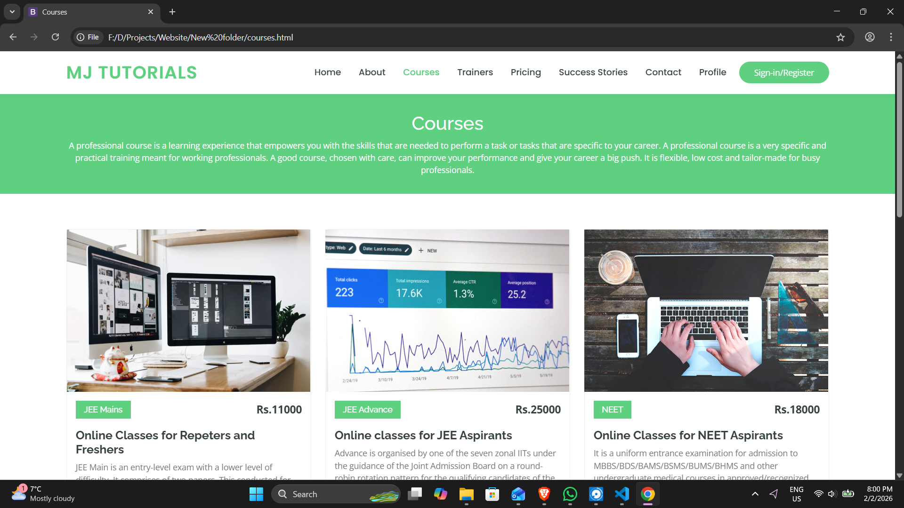
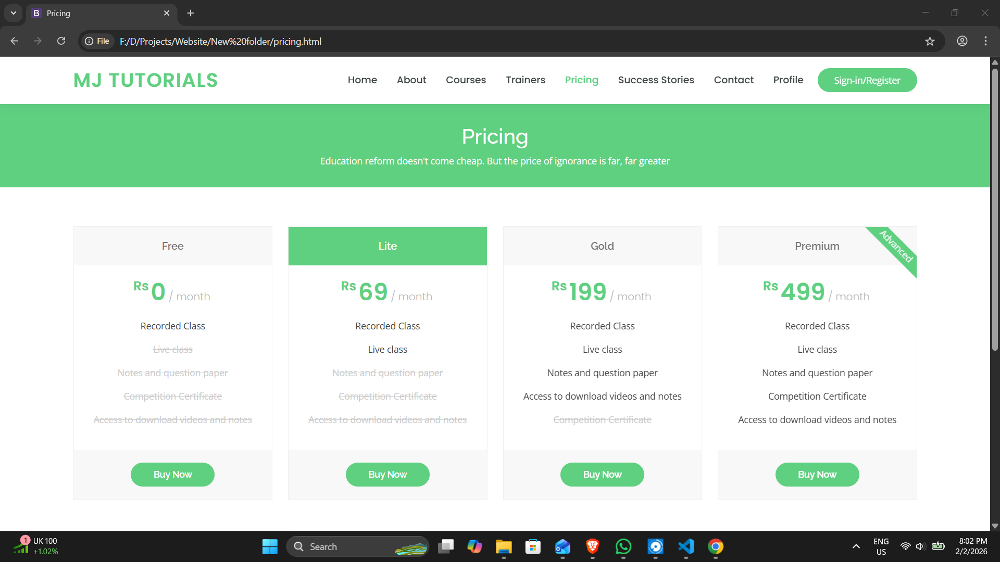
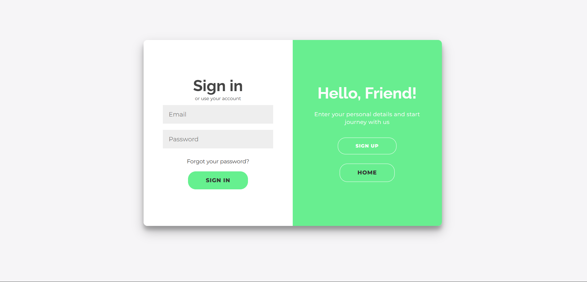
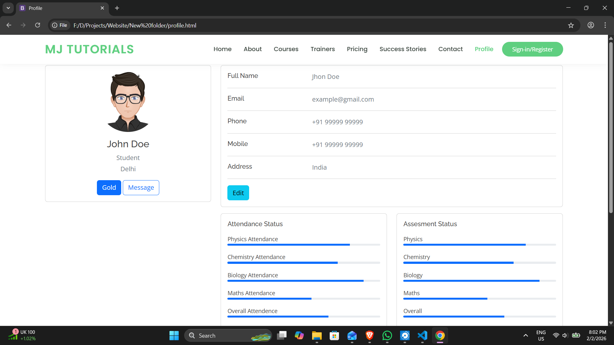
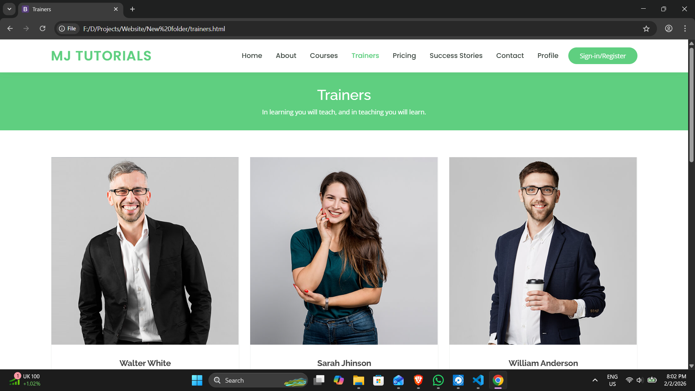

# MJ Tutorials – Online Learning Platform

A responsive multi-page EdTech web application built for PU students preparing for IIT-JEE and NEET examinations.  
This project simulates a real-world coaching institute platform with course listings, pricing plans, authentication flows, and student dashboard features.

---

## 🚀 Features

- Responsive multi-page UI using Bootstrap
- Course listing with detailed course view
- Pricing plans section
- Trainer profiles
- Student success stories (Testimonials)
- Authentication UI (Sign In & Forgot Password)
- Student profile dashboard with attendance & progress tracking
- Clean navigation and consistent UI layout

---

## 🛠️ Tech Stack

- HTML5  
- CSS3  
- Bootstrap 4  
- JavaScript  

---

## 👨‍💻 My Contributions

- Developed multiple frontend pages
- Structured the navigation flow across all modules
- Designed authentication UI and profile dashboard
- Implemented responsive layouts using Bootstrap
- Organized project structure for maintainability
- Collaborated in a team of 4 during development

---

## 📂 Project Structure

mj-tutorials-learning-platform/

├── index.html  
├── about.html  
├── courses.html  
├── course-details.html  
├── trainers.html  
├── pricing.html  
├── Signin.html  
├── forgot.html  
├── profile.html  
├── edit-profile.html  

├── assets/  
│   ├── css/  
│   ├── js/  
│   ├── img/  

└── screenshot/  
    ├── home.png  
    ├── course.png  
    ├── login.png  
    ├── pricing.png  
    ├── profile.png  
    ├── trainer.png  

---

## 📸 Screenshots

### 🏠 Home Page

### 📚 Courses Page

### 💰 Pricing Page

### 🔐 Login Page

### 👤 Student Profile Page

### 🧑‍🏫 Trainer Page

---

## 📌 Key Learnings

- Structuring a scalable frontend project
- Maintaining consistent UI components
- Improving user experience in educational platforms
- Simulating real-world product architecture
- Using Git strategically with incremental commits
- Understanding repository organization and version control hygiene

---

## 🧭 Future Enhancements

- Backend integration for authentication
- Database integration for student records
- Payment gateway integration
- Admin dashboard implementation
- Deployment to live hosting (Netlify / Vercel)

---

## 📖 Project Status

This project represents a fully functional frontend prototype of an educational platform.  
Further enhancements can transform it into a complete full-stack system.
